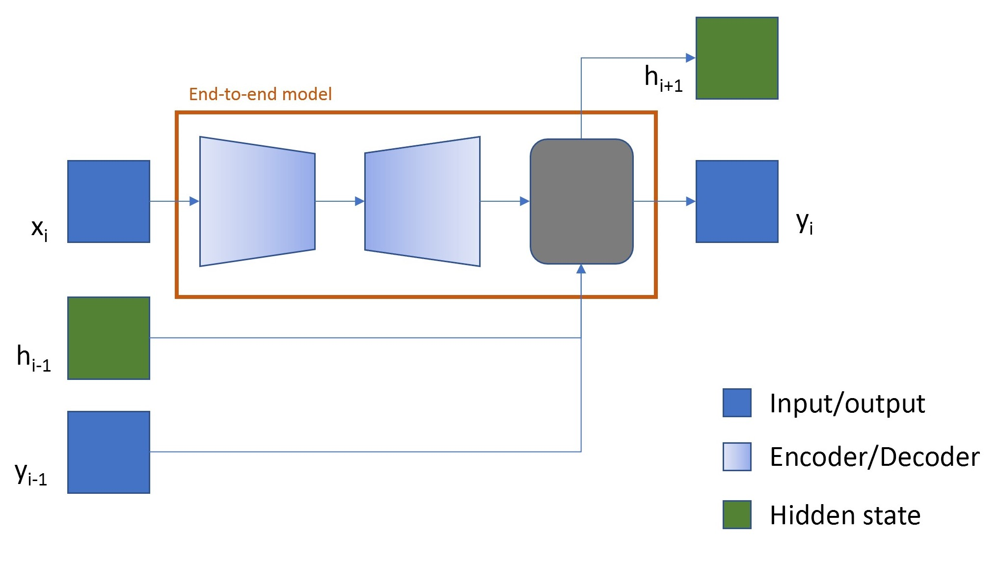
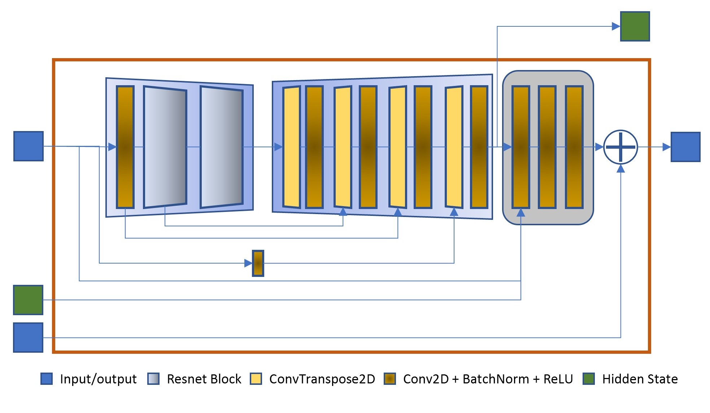
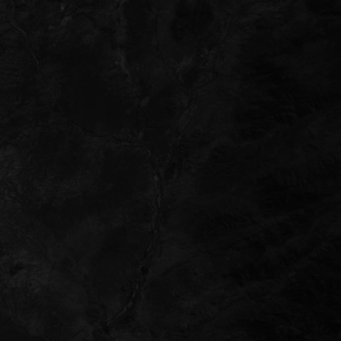
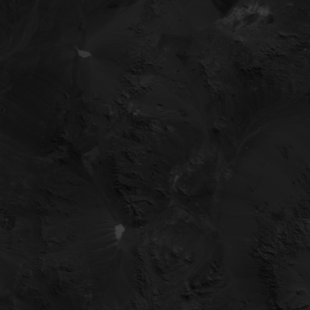
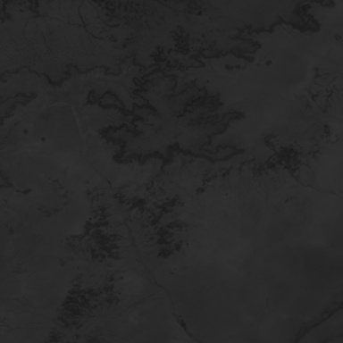
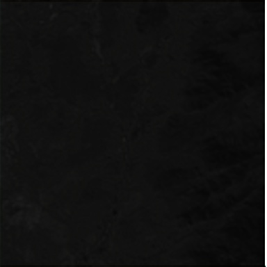
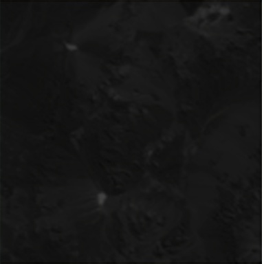
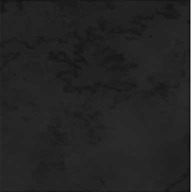
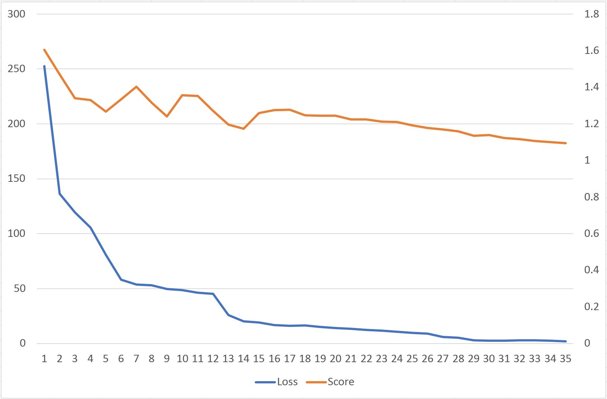

# RSuperRezNet: PROBA-V Super Resolution Algorithm

[Report for the PROBA-V Super Resolution Challenge](https://github.com/toluwajosh/proba-v-super-rez), by **[Joshua Owoyemi](https://www.linkedin.com/in/joshua-owoyemi/)**.

## 1.0 Introduction

PROBA-V is an earth observation satellite designed to map land cover and vegetation growth across the entire globe. It was launched on the 6th of May 2013 into a sun-synchronous orbit at an altitude of 820km. It's payload sensors allow for an almost global coverage (90%) per day, providing 300m resolution images. PROBA-V also provides 100m "high resolution" images, but at a lower frequency, of roughly every 5 days (dependent on the location). The goal of this challenge is to construct such high-resolution images by fusion of the more frequent 300m images.[[1]](#1)

## 1.1 Objective

Specifically the objective of the task is; given multiple images of each of 78 Earth locations, develop an algorithm to fuse them together into a single one.
The result will be a "super-resolved" image that is checked against a high resolution image taken from the same satellite. Below is a set of low resolution images and the corresponding high resolution images.

|                                     |                                     |                                     |
| ----------------------------------- | ----------------------------------- | ----------------------------------- |
|  |  |  |
|  |  |  |

In this solution, the problem is solved in an end to end approach by employing only a deep learning based model to transform the input low resolution images to the output super-resolution image.

## 2.0 Solution Idea and Intuition: Recurrent Super Resolution Network (RSuperRezNet)

The super resolution prediction problem can be thought of as a regression problem in the sense that in order to obtain a high quality super resolution image, the difference between an upsampled low resolution image and the ground truth high resolution image needs to be predicted. This difference image is then added to the low quality upsampled image to obtain an high quality one.

- First, the given low resolution image is upsampled into the same size as the high resolution image using bicubic interpolation.
- The developed model is then trained to correct the upsampled image by 'regressing' towards the ground truth.

Consequently, the super resolution output of the model is being recurrently improved through addition of new information from other low resolution samples provided.

Furthermore, adopting an end-to-end approach means that a single model is expected to utilize all the input low resolution images to produce a high quality super resolution image. Given that there are arbitrary numbers of input low resolution images, the problem can be intuitively modeled using a recurrent network except that the particular sequence of the input images is not enforced. However, it is expected that the model is able to learn important information in preceding input low resolution images and use this to iteratively refine the output of the network to match the high resolution image.

### 2.1 Optimization Objective

In order for the model to be able to output the desired super resolution images, the following objectives were optimized during training.

1. **cMSE**: This measures the pixel-wise squared error between the predicted super resolution image and the target high resolution image. However, a `brightness bias` $b$ is first computed to remove variance to brightness:
   $$
        b = \dfrac{1}{|clear(HR_{u,v})|}(\sum_{x,y\in{clear(HR_{u,v})}} HR_{u,v}(x,y)-SR(x,y))
   $$

   Then the $cMSE$ is calculated as;

   $$
        cMSE(HR_{u,v}SR) = \dfrac{1}{|clear(HR_{u,v})|} \sum_{x,y\in{clear(HR_{u,v})}} (HR_{u,v}(x,y)-(SR(x,y)+b))^2
   $$

2. **cPNSRE**: The peak to noise ratio (PSNR) was futher used to compare the predicted image with the supplied baselines $Y$, therefore referring to it as the PSNR error. This is calculated as:
   $$
        cPSNRE(HR_{u,v}SR) = Y + 10\times{log_{10}}(cMSE(HR_{u,v}SR))
   $$

<!-- ### cSSIM -->
<!-- The structural similarity index (SSIM) is another criterion that measures the similarity between two images. The measurement or prediction of image quality is based on an initial uncompressed or distortion-free image as reference. SSIM is designed to improve on traditional methods such as peak signal-to-noise ratio (PSNR) and mean squared error (MSE). In this exercise, the SSIM was evaluated for only target valid image pixels similar to the cPNSR. -->

<!-- ### Story 1 -->

<!-- ### Story 2

We can think of the super resolution image construction as an iterative refinement of low quality high resolution images using successive low quality input images. Intuitively, the model is able receive several low quality images and take useful information from each input image to construct a high quality image. -->

## 3.0 The Model

The input into the model is an upsampled low resolution image which matches the size of the high resolution image. It is observed that this results in a faster learning rate for the model converse to when the input is a low resolution image. This makes sense because, when the the input is a low resolution image, the model need to perform 2 tasks namely, image upsampling and super resolution image prediction. However, if the input is an already upsampled image, the model only needs to predict a high quality super resolution image.

The developed model consist of 3 parts:

- **Encoder:** This acts as a feature extractor, extracting important information from the input low quality image. A Resnet18[[4]](#4) base model was adopted, being a popular and effective model for many image pattern recognition tasks. Pretrained weights were also used to initialize the model before starting training.
- **Decoder:** This upsamples the extracted features back to the original size of the input image, and outputs an hidden state for the model which is used in the next iteration of the training.
- **The regressor:** A recurrent block that takes result from the decode and a previous hidden state and produces the difference image which is then added to a previous model output image to give a refined output image.

The figure below shows the model architecture with the 3 major parts:

The details of the model with each successive layer and the connections is shown below. Earlier layers in the model (from the encoder) are connected to later layers of the model through skip connections to ensure that the model captures both global and local features from the input image. The final layer ends with a Tanh activation function which allows the model to correct the output image. This is key to the regression ability of the model.

As shown in the figures, at every iteration of low resolution images, the inputs are the current input image $x_i$, a previous output from the model $Y_{i-1}$ and a previous hidden state $h_{i-1}$ which gives a current output $Y_i$ and the hidden state to be used in the next iteration $h_{i+1}$. This goes on until all images for the same target high resolution image is exhausted then the model is updated.

## 4.0 Training and Results

The supplied dataset was split into 90% training and 10% validation. Starting with a learning rate of 0.001, it was set to reduce-on-plateau with a patience of 3 epochs. The total epochs trained was 35 (at the submission of this report) on a computer with processor of Intel® Core™ i7-8700 CPU @ 3.20GHz × 12 and graphics acceleration with GeForce GTX 1060 6GB/PCIe/SSE2. 

### 4.1 Quantitative Result

The table below compares the validation result of the RSuperRezNet model with the official submissions on the Proba-V Challenge [[2]](#2). Note that the result of RSuperRezNet is unofficial since the challenge has been closed and submissions are no more accepted. While there are worst performing models, the rank of the result from RSuperRezNet falls just around the baseline. The probable reasons for this performance is discussed in section 5.1.

Training Results Leaderboard.

| Model            | Best Score |
| ---------------- | ---------- |
| Rarefin          | 0.94738863 |
| ...              | ...        |
| Baseline         | 1.00000007 |
| **RSuperRezNet** | 1.09524783 |
| ...              | ...        |
| Denpz            | 1.14706850 |

### 4.2 Qualitative Result

A set of selected super resolution images output from the developed model are shown below. The top images are the target high resolution images and the bottom images are the output of the model.

|                             |                             |                             |
| --------------------------- | --------------------------- | --------------------------- |
|  |  |  |
|  |  |  |

An interesting result here is that, because of unknown shifts in the input image and only a cropped part of the output of the model is actually used for evaluation, the model has learned to output only useful portions and leave out unimportant parts. Hence, the white borders in some output images.

## 5.0 Discussion and Conclusion

### 5.1 Discussion

The result is not impressive as the idea might have been. However, there some reasons that may indicate why.

1. **Short Training Time**: On the particular computer used for training, each training epoch takes an average of 40 minutes. This does not seem long but considering permutations of low resolution images for each iteration, in reality each training step involves many iterations which is almost impossible to capture with the number of samples for each high resolution image. Furthermore, one of the high ranking teams in the competition reported to train their model for 3000 epochs to achieve a high score (See [[3]](#3)). In addition, looking at the trend in the loss and evaluation score per epoch shown in the figure below, it can be observed that the score will still continue to reduce as training continues. **Loss is shown on the left axis and Score on the right axis.**

    

2. **Limited Training Resource and Compute**: The current training was constrained on compute power that greatly limited the model size. The GPU memory available was only 6 gigabytes which is not even enough to run the full base model (ResNet 150). Hence the smallest base model was used as the encoder (ResNet18 [[4]](#4)). Furthermore, a phenomenon known as the "Double decent"[[6]](#6)  which occurs in models such as ResNet suggests that performance first improves, then gets worse, and then improves again with increasing model size, data size, or training time. In agreement with tis phenomenon, RSuperRezNet will most probably have better performance with increased model size and training time.

## 5.2 Conclusion

In this report, a model was developed to predict super resolution images from several low resolution inputs. The model, called RSuperRezNet was used to learn the difference between an upsampled low quality image and the targed high resolution image. The solution pipeline is end-to-end and is able to use an arbitrary number of input images to predict an output. At the moment of submitting this report, the model is at par with the beseline. However, the trend and the result shows that with more training and availability of more sufficient compute, the model has a potential to surpass the baseline to be at the level of the best submitted models.
The source code of the solution is available on GitHub[[5]](#5). It also includes a model checkpoint that can be used to test the output of the model.

## 6.0 References

<a id="1">[1]</a>  [Proba-V Super Resolution Challenge, https://kelvins.esa.int/proba-v-super-resolution/problem/](https://kelvins.esa.int/proba-v-super-resolution/problem/). Retrieved on 12th December, 2019.

<a id="2">[2]</a> [Proba-V Super Resolution Challenge Leaderboard, https://kelvins.esa.int/proba-v-super-resolution/leaderboard/](https://kelvins.esa.int/proba-v-super-resolution/leaderboard/). Retrieved on 12th December, 2019.

<a id="3">[3]</a> [Molini et, al. (2019). DeepSum: Deep neural network forSuper-resolution of Unregistered Multitemporal Images. https://arxiv.org/pdf/1907.06490.pdf](https://arxiv.org/pdf/1907.06490.pdf)

<a id="4">[4]</a> [He et, al. (2015) Deep Residual Learning for Image Recognition. https://arxiv.org/abs/1512.03385](https://arxiv.org/abs/1512.03385)

<a id="5">[5]</a> [PROBA-V Super Resolution Algorithm. https://github.com/toluwajosh/proba-v-super-rez](https://github.com/toluwajosh/proba-v-super-rez)

<a id="5">[5]</a> [Nakkiran et, al (2019) Deep Double Descent: Where Bigger Models and More Data Hurt. https://arxiv.org/abs/1912.02292](https://arxiv.org/abs/1912.02292)
